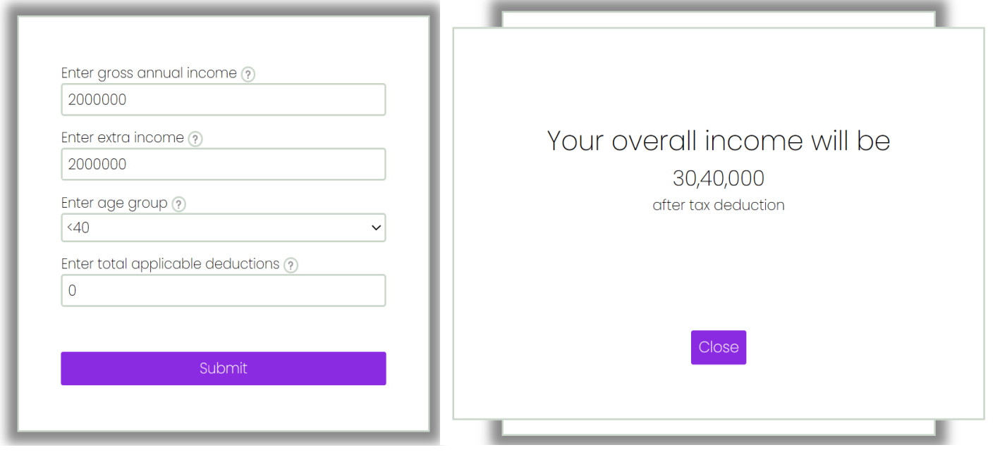
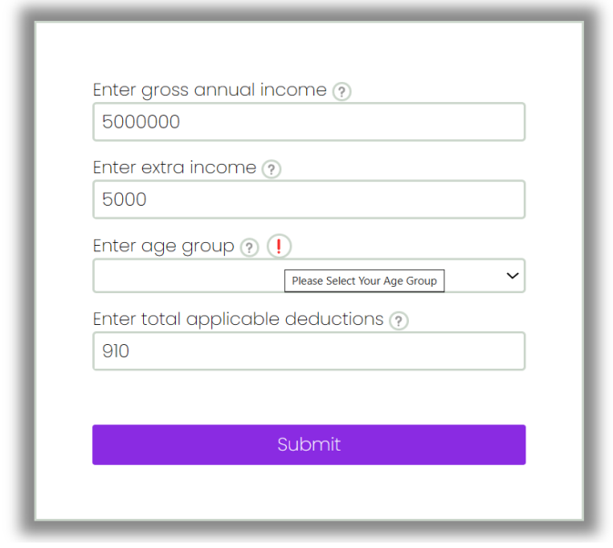
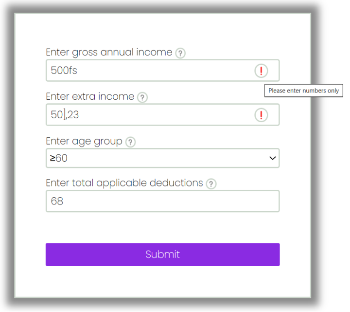

# Tax-Calculator

=> The tax calculation works based on this formula - 

    -> Overall income (after deductions) under 8 (≤) Lakhs is not taxed. 
        - if Gross Annual Income + Extra Income - Deductions =  6 Lakhs, no tax
        - if Gross Annual Income + Extra Income - Deductions =  9 Lakhs, tax
    -> Income over 8 (>) Lakhs, the amount over 8 Lakhs is taxed at
        - 30% for people with age < 40
        - 40% for people with age ≥ 40 but < 60
        - 10% for people with age ≥ 60

Test Cases -

